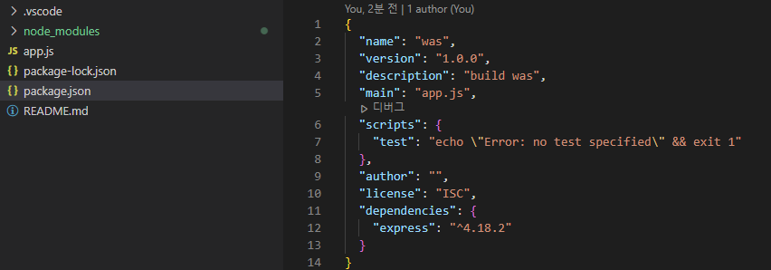

## Node.js WAS

> **목록**


---

### 1. initialize node.js server

1. package.json 생성

   ```bash
   $ npm init
   ```

   | Key            | Value                                                        |
   | -------------- | ------------------------------------------------------------ |
   | package name   | 패키지 이름으로 프로젝트 또는 현재 어플리케이션 이름.        |
   | version        | 패키지, 프로젝트, 어플리케이션 버전                          |
   | description    | 패키지, 프로젝트, 어플리케시연 설명                          |
   | entry point    | 프로젝트에서 가장 먼저 실행되는 자바스크립트 실행파일로 웹서버의 경우 index.js 혹은 app.js가 있다. |
   | test command   | 코드테스트 시에 입력해 줄 명령어로, 사용하지 않을 경우 빈 값으로 지정된다 |
   | git repository | git 저장소 주소로 사용하지 않을 경우 빈 값으로 지정된다      |
   | keywords       | 패키지, 프로젝트, 어플리케이션의 검색을 위한 키워드          |
   | license        | 패키지, 프로젝트, 어플리케이션의 라이선스로 기본값은 ISC(Internert Systems Consortium)에서 허용한 자유 소프트웨어 라이선스 |

2. express 설치

   ```bash
   npm install express --save
   ```

   

3. app.js 생성

   ```javascript
   // node_modules의 express 패키지를 가져온다.
   var express = require('express')
   ```

   


---

#### 2. Inital Nose.js server

- **node_modules**
- package.json
- package-lock.json
- app.js

> 참조
>
> 

